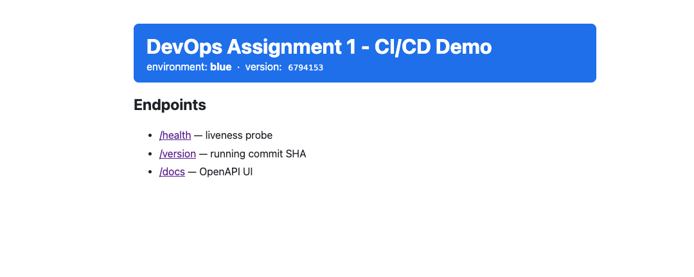
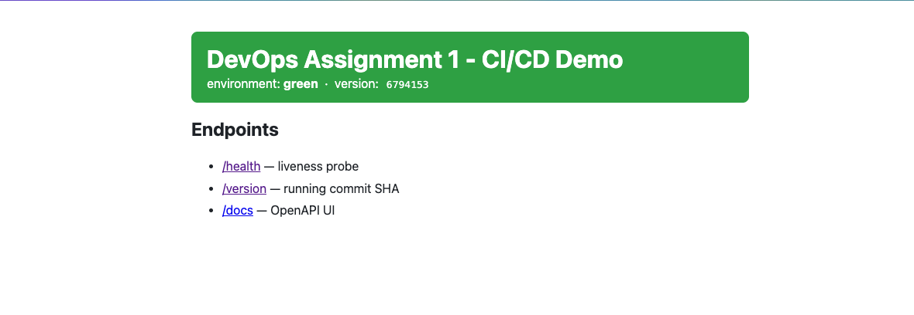
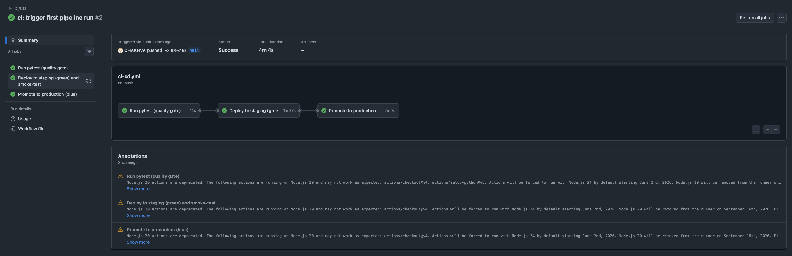
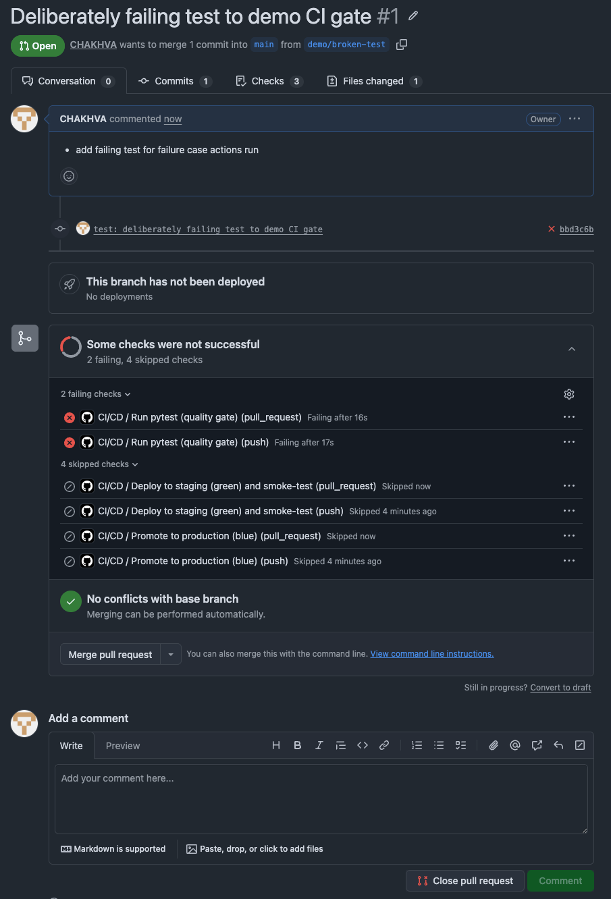
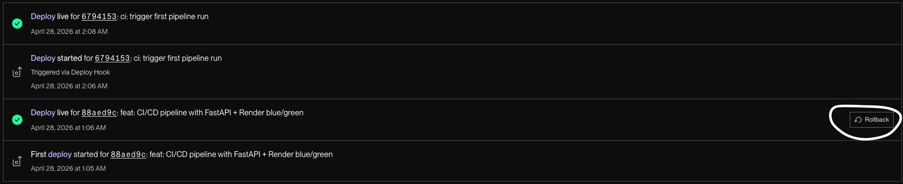
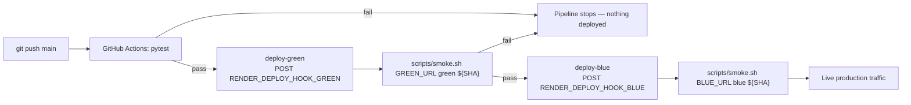

# CI/CD Pipeline Automation & Deployment Strategies

A small FastAPI service used as the vehicle for an end-to-end DevOps
pipeline. Pushes to `main` run the test suite; if it passes, GitHub
Actions deploys the commit to a **green** (staging) Render service,
runs smoke tests against it, and only then promotes the same commit to
the **blue** (production) Render service.

| Environment       | URL                                                                    |
| ----------------- | ---------------------------------------------------------------------- |
| Production (blue) | <!-- TODO: paste BLUE_URL here, e.g. https://app-blue.onrender.com --> |
| Staging (green)   | <!-- TODO: paste GREEN_URL here -->                                    |

> Assignment brief: see [DESCRIPTION.md](DESCRIPTION.md).

## Screenshots

Drop the PNG files into [`docs/screenshots/`](docs/screenshots/) using
the exact filenames below and they will render here.

| Caption                               | File                                                     |
| ------------------------------------- | -------------------------------------------------------- |
| Live application (blue)               |                |
| Live application (green, staging)     |              |
| Successful CI/CD run                  |  |
| Failing test blocking deployment      |  |
| Render Deploy History (rollback view) |  |

## Repository layout

```text
.
├── .github/workflows/ci-cd.yml   # GitHub Actions pipeline
├── app/                          # FastAPI application
│   └── main.py
├── tests/                        # pytest suite (the CI quality gate)
│   └── test_main.py
├── scripts/
│   └── smoke.sh                  # post-deploy smoke test
├── render.yaml                   # Render Blueprint (blue + green)
├── requirements.txt              # runtime deps
├── requirements-dev.txt          # runtime + test deps
├── pytest.ini
├── DESCRIPTION.md                # assignment brief
└── README.md
```

## Run locally

```bash
python -m venv .venv
source .venv/bin/activate
pip install -r requirements-dev.txt
pytest
uvicorn app.main:app --reload
```

Then open <http://127.0.0.1:8000>. Endpoints:

- `GET /` &mdash; HTML page with a coloured banner showing
  `environment` (`blue`/`green`) and `version` (short git SHA).
- `GET /health` &mdash; `{"status":"ok"}` (used by Render's health
  check and by the CI smoke tests).
- `GET /version` &mdash; `{"name", "version", "color"}`. The `version`
  field is the first 7 chars of `RENDER_GIT_COMMIT`, which is how the
  smoke tests prove the new commit is actually live.
- `GET /docs` &mdash; FastAPI's auto-generated OpenAPI UI.

## Pipeline overview



The full workflow lives at
[`.github/workflows/ci-cd.yml`](.github/workflows/ci-cd.yml). It has
three jobs chained with `needs:` so each stage gates the next:

1. **`test`** &mdash; sets up Python 3.13, installs
   `requirements-dev.txt`, runs `pytest`. Triggered on **every push and
   every pull request**, on every branch. If any test fails the
   pipeline stops here and no deployment happens.
2. **`deploy-green`** &mdash; runs only on `push` events targeting
   `main` and only if `test` succeeded. Triggers a Render deploy of
   `app-green` via its Deploy Hook, then runs
   [`scripts/smoke.sh`](scripts/smoke.sh) against `GREEN_URL`. The
   smoke script polls `/version` until the deployed commit matches
   `${{ github.sha }}`, then asserts `/health == ok` and
   `/version.color == "green"`.
3. **`deploy-blue`** &mdash; runs only if `deploy-green` succeeded.
   Triggers the Render deploy hook for `app-blue` and re-runs the
   smoke test against `BLUE_URL` to confirm the production service is
   on the new commit and healthy.

Deploys are **strictly gated by the test job** because:

- Render auto-deploy is **disabled** (`autoDeploy: false` in
  [`render.yaml`](render.yaml)) on both services.
- The only way Render ever rebuilds is via its Deploy Hook URLs, which
  are stored as GitHub Actions secrets and are only `curl`'d from the
  deploy jobs, which depend on `test`.

## Deployment strategy: simulated Blue-Green

Render's free web-service tier doesn't offer a managed
zero-downtime/blue-green primitive, so the strategy is implemented at
the pipeline level using two identical services defined in
[`render.yaml`](render.yaml):

| Service     | Role                  | Env var            | Banner colour |
| ----------- | --------------------- | ------------------ | ------------- |
| `app-blue`  | production (live URL) | `APP_COLOR=blue`   | blue          |
| `app-green` | staging               | `APP_COLOR=green`  | green         |

Both services run identical code from the same `main` branch. The
`APP_COLOR` env var is the only thing that differs and is what makes
the home page banner visibly blue or green &mdash; useful for
screenshots and for the smoke test (`/version.color`).

### How a release flows through the strategy

1. Developer merges a PR into `main`.
2. CI runs `pytest`. If anything is red, **the pipeline stops** and no
   deploy hooks are called.
3. CI calls the **green** Deploy Hook. Render rebuilds `app-green`.
4. CI polls `app-green`'s `/version` until it reports the new short
   SHA, then asserts `/health` and the green banner colour. This
   catches a build that compiled but throws at startup, a missing env
   var, a broken health-check path, etc.
5. Only if green is healthy does CI call the **blue** Deploy Hook.
   Render rebuilds `app-blue`. The same smoke test runs against
   production to confirm the promotion landed.

The result is a manually-triggered "swap" that gives us the safety
properties of blue-green &mdash; the new version runs in a live, real
environment before any user traffic hits it &mdash; without needing a
load balancer or a paid Render plan.

### Free-tier honesty

- Render free services sleep after ~15 minutes of inactivity and
  cold-start in roughly 30&ndash;60 seconds. The smoke script
  ([`scripts/smoke.sh`](scripts/smoke.sh)) handles this with a 10-minute
  polling deadline, so a wake-up doesn't cause a false failure.
- The "swap" between blue and green is a sequential redeploy of the
  same commit rather than a true atomic traffic flip. On free tier this
  is the closest simulation possible without a CDN/load balancer in
  front.

## Rollback guide

If a regression makes it past green and lands on `app-blue`, there are
two supported rollback paths.

### Path A &mdash; Render Deploy History (fastest, ~30 seconds)

Use this when you want production back **immediately** without waiting
for a new pipeline run.

1. Sign in to <https://dashboard.render.com>.
2. Open the **`app-blue`** service.
3. Click **Events** (or **Deploys**) in the left-hand sidebar.
4. Find the last known-good deploy (each entry shows its commit SHA;
   match against your git history).
5. Click the **&hellip;** menu on that row &rarr; **Rollback to this
   deploy**.
6. Render rebuilds and serves that previous commit. Confirm by
   `curl https://<BLUE_URL>/version` &mdash; the `version` field should
   show the older short SHA.
7. (Optional) Repeat the same steps on `app-green` so staging matches.

This rollback does **not** revert the git history, so the next push to
`main` would re-deploy the bad commit. Follow up with Path B to fix the
source of truth.

### Path B &mdash; `git revert` (clean history, full pipeline)

Use this when you want the rollback represented in git as well, so the
pipeline naturally re-runs and verifies the rollback the same way it
verifies any other release.

```bash
# Find the bad commit
git log --oneline

# Create a revert commit on main (or a PR if main is protected)
git revert <bad-commit-sha>
git push origin main
```

GitHub Actions then runs the full pipeline on the revert commit:
`test` &rarr; `deploy-green` &rarr; smoke test &rarr; `deploy-blue`
&rarr; smoke test. The blue service ends up on the revert commit; the
git history shows clearly what was rolled back and why.

### When to use which

| Situation                                           | Recommended path                   |
| --------------------------------------------------- | ---------------------------------- |
| Production is broken right now &mdash; need it up   | Path A, then Path B as a follow-up |
| Bad commit found but production still working       | Path B (clean history, no rush)    |
| Render dashboard inaccessible / outage on Render UI | Path B                             |

## One-time Render setup

These steps are only performed once per repository.

1. **Push this repo to GitHub** (any name; `main` is the deploy branch).
2. **Create a Render account** at <https://render.com> using "Sign in
   with GitHub" and grant access to the repo.
3. **Deploy the Blueprint:** Render Dashboard &rarr; **New +** &rarr;
   **Blueprint** &rarr; select this repo &rarr; **Apply**. Render reads
   [`render.yaml`](render.yaml) and provisions both services on the
   free plan: `app-blue` and `app-green`.
4. **Verify auto-deploy is off** on both services
   (**Settings &rarr; Build & Deploy &rarr; Auto-Deploy = No**). The
   Blueprint sets this, but double-check.
5. **Copy each service's Deploy Hook URL**: open the service
   &rarr; **Settings &rarr; Deploy Hook** &rarr; copy the URL.
6. **Copy each service's public URL** from the top of its dashboard
   page (e.g. `https://app-blue.onrender.com`).
7. **Add GitHub repository secrets** &mdash; **Settings &rarr; Secrets
   and variables &rarr; Actions &rarr; Secrets &rarr; New repository
   secret**:

   | Name                       | Value                          |
   | -------------------------- | ------------------------------ |
   | `RENDER_DEPLOY_HOOK_BLUE`  | Deploy Hook URL of `app-blue`  |
   | `RENDER_DEPLOY_HOOK_GREEN` | Deploy Hook URL of `app-green` |

8. **Add GitHub repository variables** on the **Variables** tab of the
   same page:

   | Name        | Value                     |
   | ----------- | ------------------------- |
   | `BLUE_URL`  | Public URL of `app-blue`  |
   | `GREEN_URL` | Public URL of `app-green` |

9. **Trigger the first deploy** by pushing any commit to `main` (or by
   re-running the latest workflow from the Actions tab). After a
   minute or two, both services should be live and `/version` on each
   should report the same short SHA.

## Evaluation rubric &rarr; where it's covered

| Rubric criterion                                   | Where to look                                                                                                         |
| -------------------------------------------------- | --------------------------------------------------------------------------------------------------------------------- |
| Automation: pipeline runs without manual steps     | [`.github/workflows/ci-cd.yml`](.github/workflows/ci-cd.yml)                                                          |
| Reliability: CI blocks broken code from deployment | `deploy-green` and `deploy-blue` jobs use `needs: test` and `needs: deploy-green`; `actions-failure.png` screenshot   |
| Documentation: clear, professional, screenshots    | this README + [`docs/screenshots/`](docs/screenshots)                                                                 |
| Strategic thinking: update + rollback strategy     | [Deployment strategy](#deployment-strategy-simulated-blue-green) and [Rollback guide](#rollback-guide) sections above |
